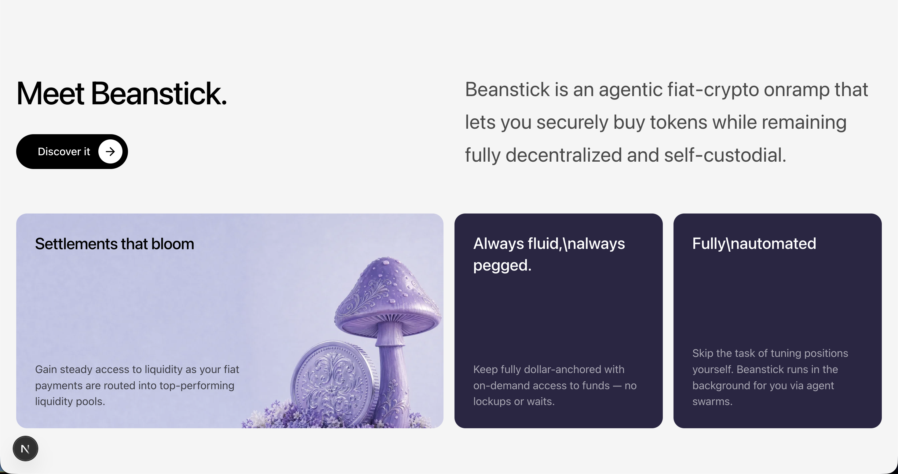
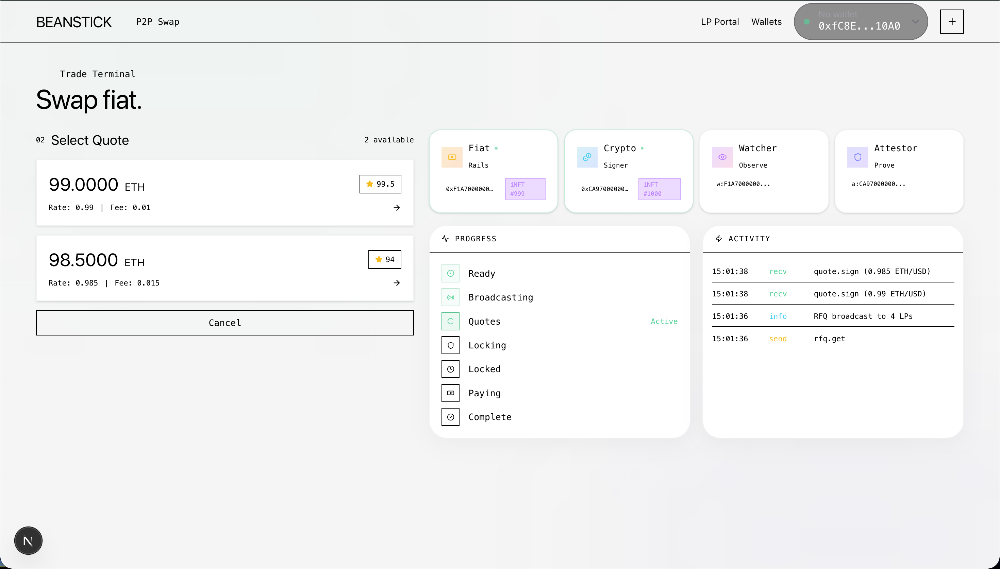
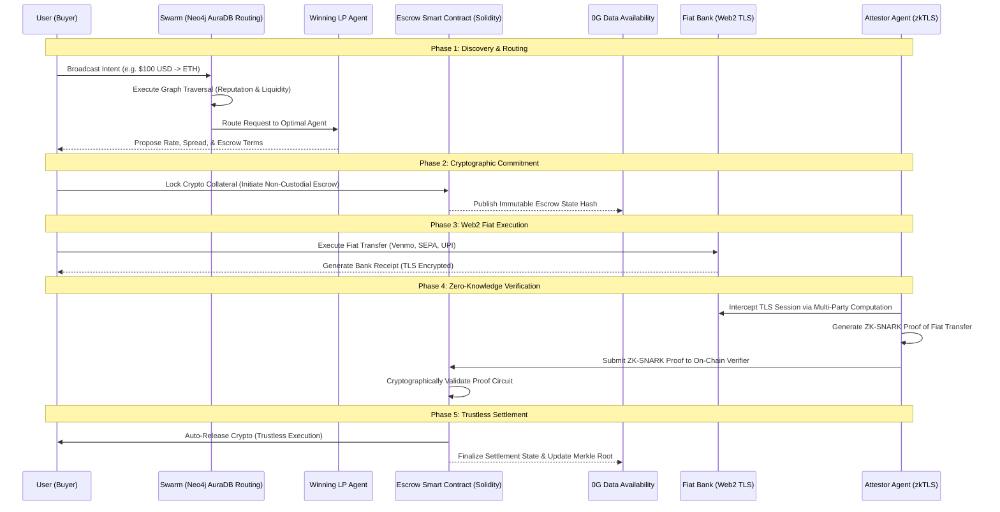

<div align="center">
  
</div>

# 🚀 Beanstick

> The autonomous fiat-to-crypto settlement network. No operators. No custodians. No centralized exchanges.

---

## 📌 Problem & Domain

Today, moving money between traditional banking and crypto is broken. It requires centralized custodians, invasive KYC, high fees, and days of waiting. 

**Themes Selected (at least one):**
- [ ] Human Experience & Productivity  
- [ ] Climate & Sustainability Systems  
- [ ] HealthTech & Bio Platforms  
- [ ] Learning & Knowledge Systems  
- [x] Work, Finance & Digital Economy  
- [ ] Infrastructure, Mobility & Smart Systems  
- [ ] Trust, Identity & Security  
- [ ] Media, Social & Interactive Platforms  
- [ ] Public Systems, Governance and Civic Tech  
- [ ] Developer Tools & Software Infrastructure  

---

## 🎯 Objective

Beanstick solves the broken fiat-to-crypto onramp by acting as a decentralized network of autonomous Liquidity Provider (LP) agents. 

- **Target Users:** Crypto users seeking low-fee, trustless, and fast onboarding from fiat to crypto.
- **Pain Point:** Centralized custodians, invasive KYC, high fees, and slow settlement times.
- **Value:** A trustless, agentic fiat-crypto onramp powered by artificial intelligence, zero-knowledge proofs, and highly scalable databases, allowing users to trade with a decentralized network of agents competing to give the best rate.

---

## 🧠 Team & Approach

### Team Name:  
`Hell Code`

### Team Members:  
- Harsh Kumar Singh (https://github.com/harshh1505 / https://www.linkedin.com/in/harshh1505 / Overall Software Development)

### Your Approach:
- **Why you chose this problem:** To revolutionize decentralized finance and eliminate counterparty risk from the fiat-to-crypto bridge.
- **Key challenges addressed:** Bridging the Web2 banking system with Web3 smart contracts trustlessly using zkTLS, and routing complex liquidity graphs in real-time.
- **Pivots/Breakthroughs:** Utilizing Neo4j AuraDB to instantly calculate trust scores and route liquidity, and using 0G Data Availability to achieve infinite scalability and low gas fees.

---

## 🛠️ Tech Stack

### Core Technologies Used:
- **Frontend:** React, Next.js, Tailwind CSS, Framer Motion
- **Backend:** Node.js (Custom AI swarm architecture)
- **Database:** Neo4j AuraDB
- **APIs:** Web2 banking APIs (e.g., Plaid, Stripe via zkTLS)
- **Hosting:** Vercel (Frontend), Sepolia Testnet, 0G Network

### Additional Technologies Used (Optional):
- [x] AI / ML  
- [x] Web3 / Blockchain  
- [ ] Cyber Security 
- [ ] Cloud  

---
 

**How we used the partner technology:**
> A critical component of Beanstick's architecture is its ability to map, analyze, and route complex liquidity graphs in real-time. We use Neo4j AuraDB for Agent Reputation Graph modeling (calculating trust scores), Liquidity Routing (executing PageRank and Betweenness Centrality across the Agent Reputation Graph), and Fraud Detection.

---

## ✨ Key Features

- ✅ **Fully Automated:** Smart agents handle the quoting, locking, and releasing of escrow funds automatically.
- ✅ **Zero Counterparty Risk:** Smart contracts ensure your crypto is only released upon cryptographically verified proof of fiat transfer.
- ✅ **zkTLS Verification:** Bank transfers are verified securely and privately in real-time.
- ✅ **Premium Fintech UI:** A sleek, user-friendly interface designed for mass adoption.

<div align="center">
  
  <br/><br/>
  
  <br/><br/>
  
</div>

---

## 📽️ Demo & Deliverables

- **Demo Video Link (Mandatory):** [To be added later]
- **Deployment Link (Recommended):** [https://beanstick.vercel.app/](https://beanstick.vercel.app/)
- **Pitch Deck / PPT (Optional):** [To be added later]

---

## ✅ Tasks & Bonus Checklist

- [x] All team members completed the mandatory social task  
- [ ] Bonus Task 1 – Badge sharing  
- [ ] Bonus Task 2 – Blog/article  

---

## 🧪 How to Run the Project

### Requirements:
- Node.js (v18+)
- pnpm (If not installed, run `npm install -g pnpm`)
- A valid Neo4j AuraDB URI and credentials

### Local Setup:
```bash
# 1. Clone the repository
git clone https://github.com/harshh1505/beanstick.git
cd beanstick

# 2. Install dependencies
pnpm install

# 3. Setup environment variables
# Create a .env file based on .env.example and add your configuration (including your Neo4j credentials).

# 4. Start all services (Next.js web app, Agent server, and Webhook receiver)
chmod +x start-all.sh
./start-all.sh

# Alternatively, to run only the frontend development server:
pnpm --filter web run dev
```

### Access Points:
- **Web App:** [http://localhost:3000](http://localhost:3000)
- **Agent Server:** [http://localhost:4002](http://localhost:4002)
- **Webhook Receiver:** [http://localhost:4001](http://localhost:4001)
---

## ⚙️ Deep-Dive Technical Documentation

Beanstick operates on a highly complex, multi-layered architecture designed to solve the "trust" problem inherent in Web2-to-Web3 bridges. By combining a **Decentralized Agentic Swarm Protocol**, **zkTLS (Zero-Knowledge Transport Layer Security) Verification**, and **0G Data Availability (DA)**, we achieve a strictly non-custodial, trustless execution environment that completely eliminates counterparty risk.

### 1. The Agentic Swarm Protocol Layer

Traditional P2P exchanges rely on centralized order books or static liquidity pools (AMMs). Beanstick introduces an autonomous **Agentic Swarm Protocol**.

- **Swarm Dynamics:** The network consists of thousands of independent Liquidity Provider (LP) AI agents. These agents run lightweight Node.js instances connected to their own Web2 banking APIs (e.g., Plaid, Stripe) and Web3 hot wallets.
- **Dynamic Quoting:** When a user requests a settlement (e.g., USD to ETH), the swarm executes an English-style reverse auction in milliseconds. Agents analyze the user's intent, their own liquidity reserves, and network gas fees to generate real-time, highly competitive quotes.
- **Neo4j Graph Routing Heuristics:** To prevent spam and ensure the user receives the best quote from a *reliable* agent, Beanstick utilizes **Neo4j AuraDB**. We run the `PageRank` and `Betweenness Centrality` algorithms across the Agent Reputation Graph. Only agents with high trust scores and successful historical settlement paths are allowed to win the auction.

### 2. Architectural Workflow Diagram

The following sequence illustrates the complex lifecycle of a Decentralized Settlement Network (DSN) transaction:



### 3. Non-Custodial Smart Contract Escrow (Layer 1 / Layer 2)

The escrow logic is enforced via highly optimized Solidity smart contracts.

- **Deterministic Locking Mechanism:** When an agreement is reached, the LP agent locks the agreed-upon cryptocurrency into the Escrow Contract. The contract locks the funds with a strict `block.timestamp` deadline.
- **State Transition Machine:** The contract operates as a strict finite-state machine (FSM) traversing: `INITIATED` -> `LOCKED` -> `AWAITING_PROOF` -> `RELEASED` or `REFUNDED`.
- **Zero-Trust Release:** No admin, multisig, or central authority can move the funds. The `release()` function requires a valid ZK-SNARK cryptographic proof as its sole parameter. If the proof is valid, the funds route to the user. If the deadline expires without a valid proof, the `refund()` function safely returns the capital to the LP.

### 4. zkTLS: Bridging Web2 and Web3

The most critical innovation in Beanstick is bridging the Web2 banking system with Web3 smart contracts without relying on centralized oracles like Chainlink.

- **Multi-Party Computation (MPC):** Attestor agents act as a proxy between the user and the bank's HTTPS server. They split the TLS session keys using MPC. This allows the Attestor to verify the exact HTML/JSON response from the bank (proving the fiat transfer occurred) *without* ever seeing the user's login credentials or sensitive PII.
- **ZK-SNARK Generation:** The Attestor generates a concise Zero-Knowledge Proof (ZK-SNARK) asserting: "A transfer of $100 to the LP's account was successful." This proof is tiny (a few hundred bytes) and takes milliseconds to verify on-chain.

### 5. Infinite Scalability via 0G Data Availability

Storing complex agent attestations, cryptographic proofs, and settlement states directly on Layer 1 (Ethereum) would result in exorbitant gas fees. 

- **Data Sharding:** Beanstick anchors all high-throughput, non-consensus critical data to the **0G Data Availability (DA)** layer. 
- **Merkle Roots:** We batch thousands of settlement states into a single Merkle Tree and post only the Merkle Root to the Layer 1 smart contract. This provides Layer 1 security guarantees with Layer 2 costs, allowing the agent swarm to process millions of micro-transactions per second.

---

## 🧬 Future Scope

- 📈 More integrations with global fiat gateways
- 🛡️ Security enhancements and cross-chain multi-agent protocols
- 🌐 Localization and mobile application releases for broader accessibility

---

## 📎 Resources / Credits

- **0G Network** for Data Availability  
- **Neo4j AuraDB** for Graph Routing  
- **React, Next.js, and Framer Motion** for the UI  

---

## 🏁 Final Words

Built with ❤️ by Harsh Kumar Singh for the HackHazards Hackathon. The journey of building Beanstick has been an amazing exploration of zkTLS, Neo4j graphs, and trustless agent protocols!

---
